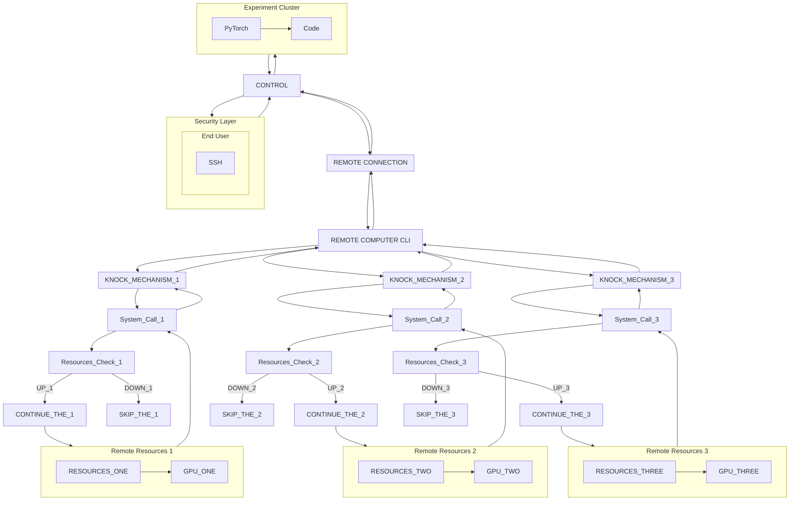

# rl-distributed-computing

Distrbuted computing system for [Imitation Learning](https://github.com/LeeMarshall1113/jetspace-imitation-learning)

# Diagram Draft

```mermaid
graph TD
    subgraph K[Remote Resources 1]
        RESOURCES_ONE --> GPU_ONE
    end
    subgraph KNOCK_MECHANISM_1
    end
    subgraph KNOCK_MECHANISM_2
    end
    subgraph KNOCK_MECHANISM_3
    end
    subgraph E[Remote Resources 2]
        RESOURCES_TWO --> GPU_TWO
    end
    subgraph F[Remote Resources 3]
        RESOURCES_THREE --> GPU_THREE
    end
    subgraph X[REMOTE CONNECTION]
    end
    subgraph Y[Security Layer]
          subgraph J[End User]
                SSH
            end
      end
    subgraph Z[Experiment Cluster]
        PyTorch --> Code
    end

    CONTROL --> X[REMOTE CONNECTION]
    CONTROL --> Y[Security Layer]
    X[Remote Connction] --> A[REMOTE COMPUTER CLI]
    X[Remote Connction] --> CONTROL
    Y[Security Layer] --> CONTROL
    A[REMOTE COMPUTER CLI] --> KNOCK_MECHANISM_1
    KNOCK_MECHANISM_1 --> System_Call_1
    System_Call_1 --> Resources_Check_1
    Resources_Check_1 -->|UP_1| CONTINUE_THE_1 --> K[Remote Resources 1] --> System_Call_1 --> KNOCK_MECHANISM_1 --> A[REMOTE COMPUTER CLI]
    Resources_Check_1 -->|DOWN_1| SKIP_THE_1
    A[REMOTE COMPUTER CLI] --> KNOCK_MECHANISM_2
    KNOCK_MECHANISM_2 --> System_Call_2
    System_Call_2 --> Resources_Check_2
    Resources_Check_2 -->|UP_2| CONTINUE_THE_2 --> E[Remote Resources 2] --> System_Call_2 --> KNOCK_MECHANISM_2 --> A[REMOTE COMPUTER CLI]
    Resources_Check_2 -->|DOWN_2| SKIP_THE_2
    A[REMOTE COMPUTER CLI] --> KNOCK_MECHANISM_3
    KNOCK_MECHANISM_3 --> System_Call_3
    System_Call_3 --> Resources_Check_3
    Resources_Check_3 -->|UP_3| CONTINUE_THE_3 --> F[Remote Resources 3] --> System_Call_3 --> KNOCK_MECHANISM_3 --> A[REMOTE COMPUTER CLI]
    Resources_Check_3 -->|DOWN_3| SKIP_THE_3  
    A[REMOTE COMPUTER CLI] --> X[Remote Connection]
    CONTROL --> Z[Experiment Cluster]
    Z[Experiment Cluster] --> CONTROL
```
