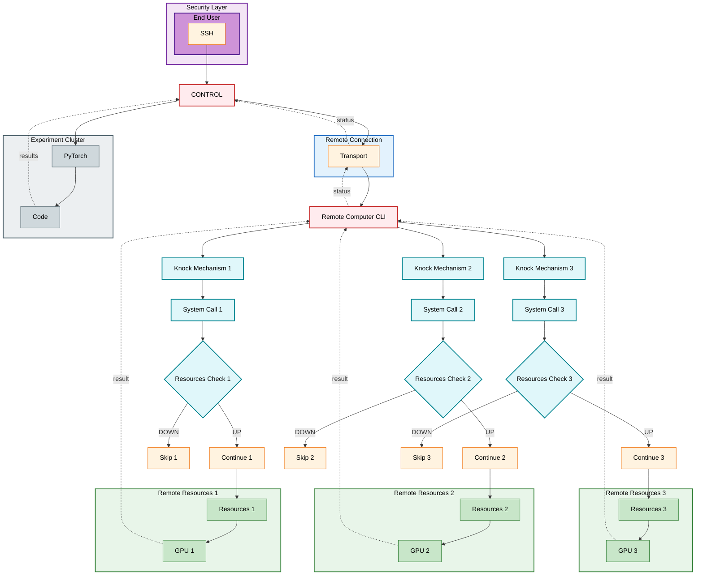

# rl-distributed-computing

Distributed computing system for [Imitation Learning](https://github.com/LeeMarshall1113/jetspace-imitation-learning)

# Diagram Draft

```mermaid
graph TD

    subgraph Y[Security Layer]
        style Y fill:#f3e5f5,stroke:#6a1b9a,stroke-width:2px,color:#000
        subgraph J[End User]
            style J fill:#ce93d8,stroke:#4a148c,stroke-width:2px,color:#000
            SSH[SSH]
        end
    end

    subgraph X[Remote Connection]
        style X fill:#e3f2fd,stroke:#1565c0,stroke-width:2px,color:#000
        TRANSPORT[Transport]
    end

    subgraph Z[Experiment Cluster]
        style Z fill:#eceff1,stroke:#455a64,stroke-width:2px,color:#000
        PyTorch[PyTorch] --> Code[Code]
    end

    subgraph K[Remote Resources 1]
        style K fill:#e8f5e9,stroke:#2e7d32,stroke-width:2px,color:#000
        RESOURCES_ONE[Resources 1] --> GPU_ONE[GPU 1]
    end

    subgraph E[Remote Resources 2]
        style E fill:#e8f5e9,stroke:#2e7d32,stroke-width:2px,color:#000
        RESOURCES_TWO[Resources 2] --> GPU_TWO[GPU 2]
    end

    subgraph F[Remote Resources 3]
        style F fill:#e8f5e9,stroke:#2e7d32,stroke-width:2px,color:#000
        RESOURCES_THREE[Resources 3] --> GPU_THREE[GPU 3]
    end

    CONTROL[CONTROL]
    A[Remote Computer CLI]

    SSH --> CONTROL
    CONTROL --> TRANSPORT
    TRANSPORT --> A
    A -.->|status| TRANSPORT
    TRANSPORT -.->|status| CONTROL

    CONTROL --> PyTorch
    Code -.->|results| CONTROL

    A --> KNOCK_MECHANISM_1[Knock Mechanism 1]
    KNOCK_MECHANISM_1 --> System_Call_1[System Call 1]
    System_Call_1 --> Resources_Check_1{Resources Check 1}
    Resources_Check_1 -->|UP| CONTINUE_THE_1[Continue 1]
    Resources_Check_1 -->|DOWN| SKIP_THE_1[Skip 1]
    CONTINUE_THE_1 --> RESOURCES_ONE
    GPU_ONE -.->|result| A

    A --> KNOCK_MECHANISM_2[Knock Mechanism 2]
    KNOCK_MECHANISM_2 --> System_Call_2[System Call 2]
    System_Call_2 --> Resources_Check_2{Resources Check 2}
    Resources_Check_2 -->|UP| CONTINUE_THE_2[Continue 2]
    Resources_Check_2 -->|DOWN| SKIP_THE_2[Skip 2]
    CONTINUE_THE_2 --> RESOURCES_TWO
    GPU_TWO -.->|result| A

    A --> KNOCK_MECHANISM_3[Knock Mechanism 3]
    KNOCK_MECHANISM_3 --> System_Call_3[System Call 3]
    System_Call_3 --> Resources_Check_3{Resources Check 3}
    Resources_Check_3 -->|UP| CONTINUE_THE_3[Continue 3]
    Resources_Check_3 -->|DOWN| SKIP_THE_3[Skip 3]
    CONTINUE_THE_3 --> RESOURCES_THREE
    GPU_THREE -.->|result| A

    classDef controlNodes fill:#ffebee,stroke:#c62828,stroke-width:2px,color:#000;
    classDef sysCalls fill:#e0f7fa,stroke:#00838f,stroke-width:2px,color:#000;
    classDef resources fill:#c8e6c9,stroke:#2e7d32,stroke-width:1px,color:#000;
    classDef actions fill:#fff3e0,stroke:#ef6c00,stroke-width:1px,color:#000;
    classDef clusterNodes fill:#cfd8dc,stroke:#455a64,stroke-width:1px,color:#000;

    class CONTROL,A controlNodes;
    class KNOCK_MECHANISM_1,KNOCK_MECHANISM_2,KNOCK_MECHANISM_3 sysCalls;
    class System_Call_1,System_Call_2,System_Call_3 sysCalls;
    class Resources_Check_1,Resources_Check_2,Resources_Check_3 sysCalls;
    class RESOURCES_ONE,GPU_ONE,RESOURCES_TWO,GPU_TWO,RESOURCES_THREE,GPU_THREE resources;
    class CONTINUE_THE_1,SKIP_THE_1,CONTINUE_THE_2,SKIP_THE_2,CONTINUE_THE_3,SKIP_THE_3 actions;
    class SSH,TRANSPORT actions;
    class PyTorch,Code clusterNodes;
```
